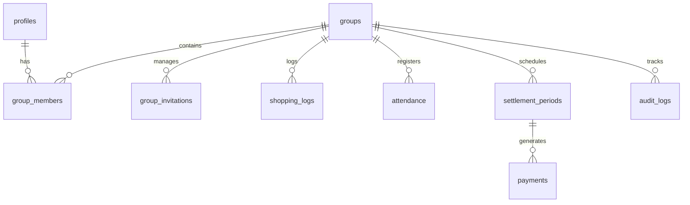

# Database and Security Specifications

CoBuy uses Supabase (PostgreSQL) as its primary data store. The database layer is designed for high data integrity, strict row-level security (RLS), concurrency control, and deterministic audit trails.

## Database Schema Design

The application maintains 10 primary relational tables with foreign key constraints configured to prevent cascading deletes of financial transaction logs:

### Table Dictionary

1. **`profiles`**: Stores user display names and avatars. Synchronized automatically via database triggers on Supabase Auth signup.
2. **`groups`**: Contains group metadata and the configuration settings (such as cost `allocation_mode`).
3. **`group_members`**: Tracks membership history (`joined_at`, `left_at`) and access roles (`ADMIN`, `MEMBER`).
4. **`group_invitations`**: Stores SMTP invitation tokens, roles, and status checks.
5. **`shopping_logs`**: Grocery bill logs containing payer, amount, note, and type (`MEAL` or `SHARED`).
6. **`attendance`**: Daily check-ins (Breakfast, Lunch, Dinner) with status (`EATEN`, `NOT_EATEN`).
7. **`settlement_periods`**: Defines intervals (Start Date, End Date) for locking transaction records.
8. **`payments`**: Generated when locking a period to list optimal debts and status (`PENDING`, `PAID`).
9. **`notifications`**: Stores push and inbox notifications.
10. **`audit_logs`**: Tracks administration events (like unlocking a settlement period).

---

## Row Level Security (RLS) Policy System

To prevent cross-tenant data leaks, all tables have RLS enabled. Policies call custom SQL helper functions:

### 1. Security Check Functions

- **`public.is_group_member(group_id, user_id)`**: Checks if the user is an active member of the group on the current date.
- **`public.is_group_admin(group_id, user_id)`**: Checks if the user is a member with the `ADMIN` role.

### 2. Table Access Rules

| Table | SELECT Policy | INSERT Policy | UPDATE Policy | DELETE Policy |
| :--- | :--- | :--- | :--- | :--- |
| `profiles` | Authenticated | Authenticated | Owner Only | Disabled |
| `groups` | Member Only | Authenticated | Admin Only | Disabled |
| `group_members` | Member Only | Admin Only | Admin Only | Disabled |
| `shopping_logs` | Member Only | Member Only | Payer or Admin | Disabled (Use soft `VOID`) |
| `attendance` | Member Only | Member (Self/Admin) | Member (Self/Admin) | Disabled |
| `settlement_periods` | Member Only | Admin Only | Admin Only | Disabled |
| `payments` | Member Only | System Only | Payer/Receiver/Admin | Disabled |
| `audit_logs` | Member Only | System Only | Disabled | Disabled |

---

## Financial Integrity & Safeguards

### 1. Database Lock Trigger (`check_settlement_lock`)
Any modification (INSERT, UPDATE, DELETE) to financial logs (`shopping_logs`, `attendance`) triggers a check against `settlement_periods`. If the shopping date or attendance date falls within a period marked as `LOCKED`, the transaction is rejected with an SQL exception. This guarantees that finalized accounts cannot be manipulated.

### 2. Optimistic Concurrency Control (OCC)
All write models (`groups`, `shopping_logs`, `payments`, `settlement_periods`) carry an integer `version` field. Updates check that the database version matches the version read by the client. If they differ (concurrency conflict), the write fails, prompting the user to refresh.
